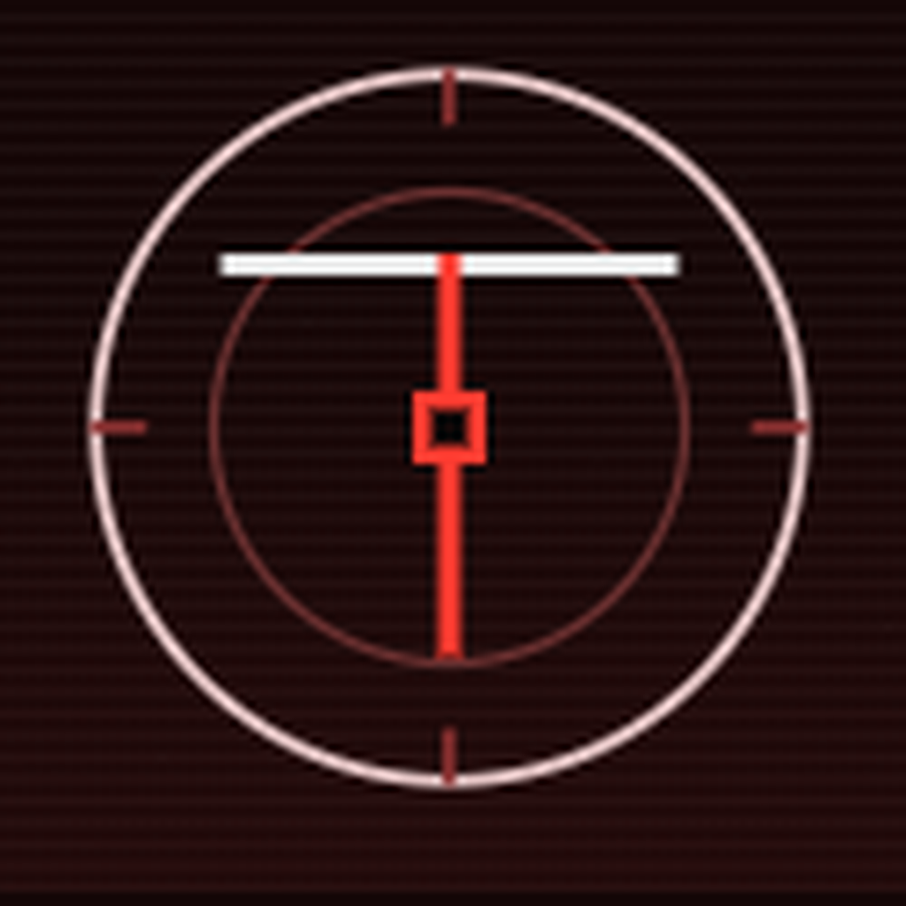

<p align="center">
  
</p>

<h1 align="center">TOMO</h1>

<p align="center">
  <strong>Section Division</strong> — natywny instrument desktopowy na Windows<br>
  Void · meridian · bodies · CAP packs · dane tylko na Twoim PC
</p>

<p align="center">
  <a href="https://github.com/TomoSectionDivision/Tomo-Section-Division/releases"></a>
  
  
  
</p>

<p align="center">
  <a href="#instalacja-releases">Instalacja</a> ·
  <a href="#uruchomienie-z-źródła">Źródło</a> ·
  <a href="#build-instalatora">Build</a> ·
  <a href="#dane-lokalne">Dane</a> ·
  <a href="#instrument">Instrument</a>
</p>

---

## Instalacja (Releases)

Najprostsza droga — bez kompilacji:

1. Wejdź w **[Releases](https://github.com/TomoSectionDivision/Tomo-Section-Division/releases)**
2. Pobierz najnowszy `TOMO_*_x64-setup.exe`
3. Zainstaluj → uruchom **Tomo** z menu Start

Po restarcie Windowsa biblioteka, draft i sample zostają na tym komputerze.

> Brak pliku w Releases? Zbuduj instalator lokalnie (sekcja [Build](#build-instalatora)) albo poczekaj na publikację.

---

## Uruchomienie z źródła

```bash
git clone https://github.com/TomoSectionDivision/Tomo-Section-Division.git
cd Tomo-Section-Division
npm install
npm run dev
```

**Wymagania (Windows):** Node.js · Rust · [Tauri 2 prerequisites](https://v2.tauri.app/start/prerequisites/)

Okno startuje w fullscreen · `F11` przełącza windowed / fullscreen.

---

## Build instalatora

Z katalogu sklonowanego repo:

```bash
npm install
npm run build:win
```

Gotowy NSIS znajdziesz w:

```text
src-tauri/target/release/bundle/nsis/TOMO_0.3.4_x64-setup.exe
```

(ścieżka względem katalogu projektu — u Ciebie tam, gdzie sklonowałeś repo)

---

## Dane lokalne

Tomo **nie wysyła** sectionów do chmury. Wszystko zostaje na maszynie użytkownika.

| Dane | Gdzie |
|------|--------|
| Section library + miniatury | IndexedDB (profil WebView aplikacji) |
| Autosave draft | localStorage |
| MATCH — własne sample | IndexedDB |
| CAP packs | folder Pobrane → `TOMO/{session}/` |
| DNA↓ | folder Pobrane |

---

## Instrument

| | |
|---|---|
| **Void** | Bodies na meridianie · SEED · FORM · DUAL |
| **Sound** | SYNTH ↔ MATCH · master glue · KIT |
| **Capture** | CAP pack → Pobrane/`TOMO/{session}/` |
| **Time** | TEMPO (BPM + swing) · PROG / MOTIF / BASS |
| **DNA** | v2 — MATCH, swing, splices, wet |
| **LIVE** | PERF · FORM · SEED · CAP · DUAL · KIT · LIB · SYNTH/MATCH |
| **MORE…** | PREFS · REC · VID · DNA · reset tutorialu |
| **Perform** | klawisz `P` — live deck |
| **Library** | klawisz `L` — fork / rename / thumbs |

Główny UI: [`src/index.html`](src/index.html)

---

## Licencja / kontakt

Repo publiczne organizacji **TomoSectionDivision**.

Pytania: [tomo.contact@proton.me](mailto:tomo.contact@proton.me)
